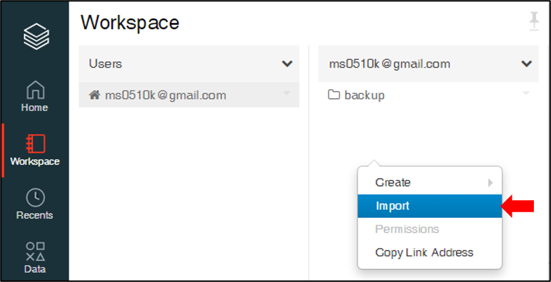
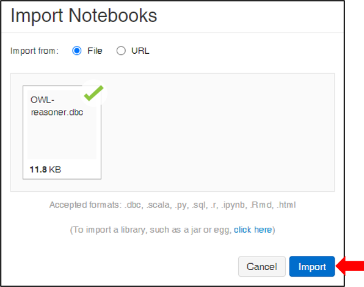
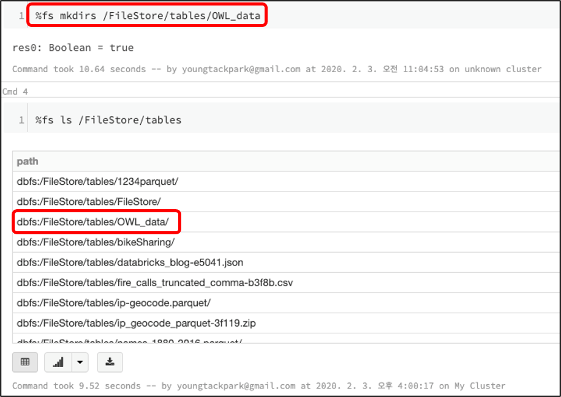
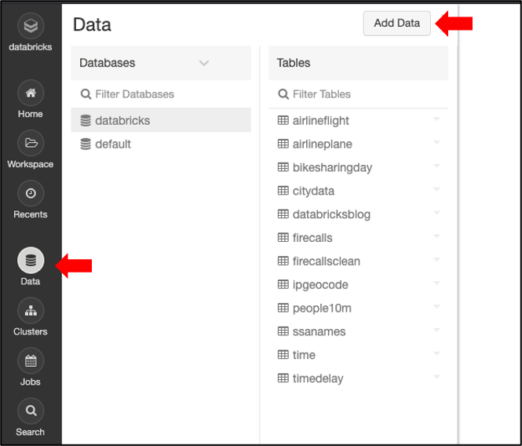
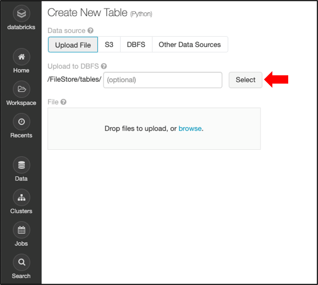
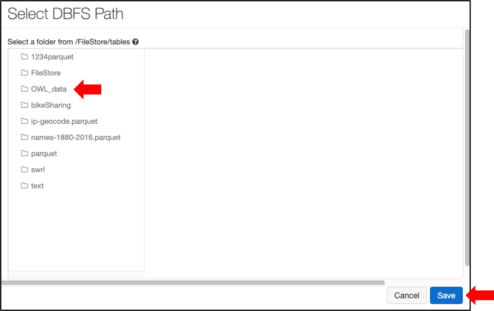
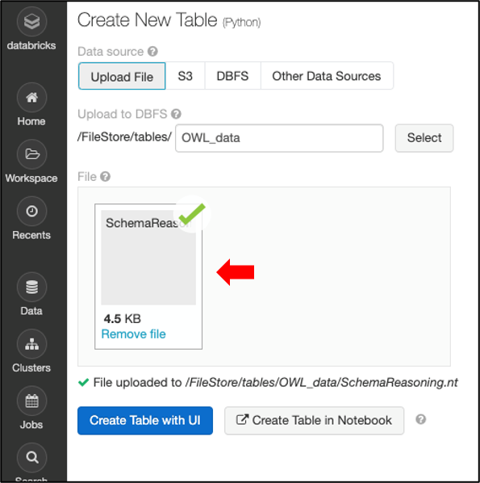

# OWL_Horst_Reasoning

## Azure Databricks 코드 업로드

1. Workspace 여백 우클릭



2. OWL-reasoner.dbc 파일 업로드 및 import



## Cluster 생성 및 Spec
```
Master Node : 1
Slave Node : 7
CPU : 2.4GHz 8Core (Node Per)
Memory : 56GB
```
## Data 저장 공간 생성
1. 업로드한 코드에서 저장공간 생성 셀 실행
```
%fs mkdirs /FileStore/tables/OWL_data
```


## Data 업로드
1. 좌측 메뉴 Data클릭 및 Add Data 클릭



2. Select 클릭



3. 생성한 데이터 저장공간 OWL_data 선택 및 Save 클릭



4. Data파일 드래그앤드롭 방식으로 업로드



## 추론 시스템 실행
1. 업로드한 코드 상단 메뉴에서 Run All 클릭


