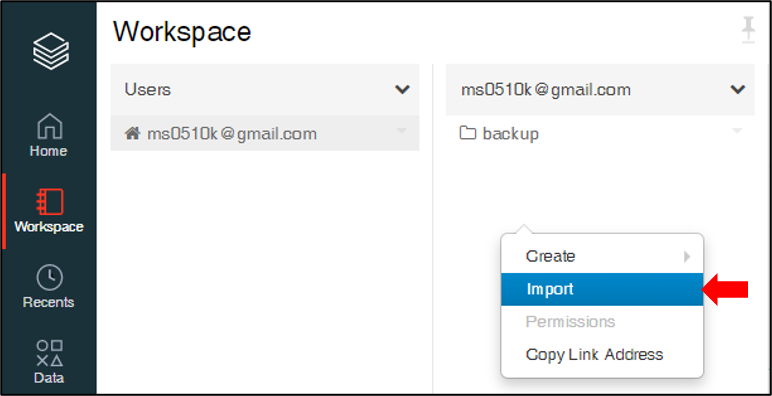
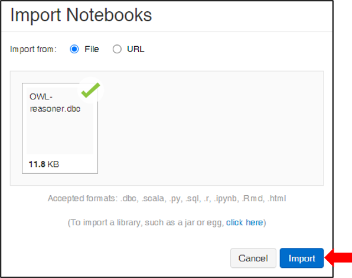

# OWL_Horst_Reasoning

## Azure Databricks 코드 업로드
{: width="300" height="300"){: .center}
{: width="300" height="300"){: .center}

## Cluster Spec
```
Master Node : 1
Slave Node : 7
CPU : 2.4GHz 8Core (Node Per)
Memory : 56GB
